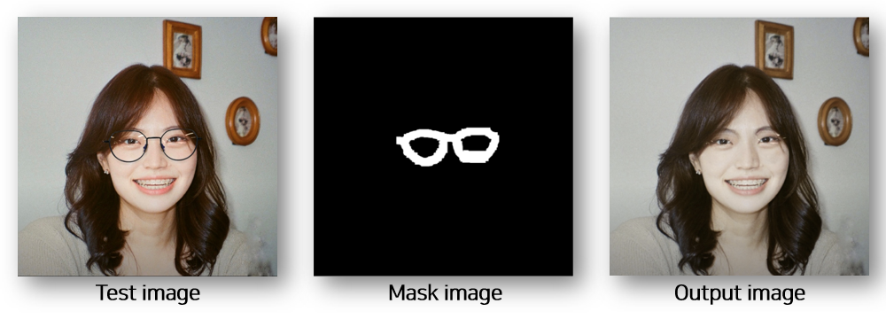
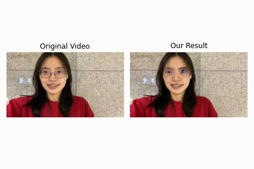

# SeeFit AI
## 🖌️ Image Inpainting 
- Base Model: [LaMa](https://github.com/saic-mdal/lama)
-  실습 내용 정리: [티스토리](https://maktubi.tistory.com/266)

### Environment Setting
1. Git clone:
```python
!git clone https://github.com/SeeFit/SeeFit_AI.git
```

2. Python virtualenv:
```python
virtualenv inpenv --python=/usr/bin/python3
!source inpenv/bin/activate
!pip install torch==1.8.0 torchvision==0.9.0

cd Image_Inpainting/lama
!pip install -r requirements.txt 
```

### Run Code
0. Setting:
```python
export TORCH_HOME=$(pwd) && export PYTHONPATH=$(pwd)
```

1. Download pre-trained models:
```python
!pip3 install wldhx.yadisk-direct
```
```python
!curl -L $(yadisk-direct https://disk.yandex.ru/d/ouP6l8VJ0HpMZg) -o big-lama.zip
!unzip big-lama.zip
```
```python
!curl -L $(yadisk-direct https://disk.yandex.ru/d/EgqaSnLohjuzAg) -o lama-models.zip
!unzip lama-models.zip
```
2. Prepare test data

3. Predict
```python
!python3 bin/predict.py model.path=$(pwd)/big-lama indir=$(pwd)/LaMa_test_images outdir=$(pwd)/output
```

### Result


## 🖌️ Video Inpainting
- Base Model: [E2FGVI](https://github.com/MCG-NKU/E2FGVI)

### Environment Setting
1. Git clone:
```python
!git clone https://github.com/MCG-NKU/E2FGVI.git 
```

### Run Code
0. Setting:
```python
!pip install torch==1.5.1+cu101 torchvision==0.6.1+cu101 -f https://download.pytorch.org/whl/torch_stable.html 
!pip install mmcv-full -f https://download.openmmlab.com/mmcv/dist/cu101/torch1.5/index.html
```

1. Download pre-trained models:
```python
cd Video_Inpainting/E2FGVI
!unzip E2FGVI_CVPR22_models.zip 
```

2. Prepare test data

3. Predict
```python
!python test.py --model e2fgvi (or e2fgvi_hq) --video examples/mijin --mask examples/mijin_mask  --ckpt release_model/E2FGVI-CVPR22.pth (or release_model/E2FGVI-HQ-CVPR22.pth)

!python test.py --model e2fgvi (or e2fgvi_hq) --video examples/mijin.mp4 --mask examples/mijin_mask  --ckpt release_model/E2FGVI-CVPR22.pth (or release_model/E2FGVI-HQ-CVPR22.pth)
```

### Result

